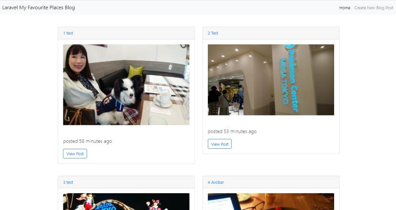

## My Favourite Places Blog

This is a blog app using laravel.

#Image

#Future Plan

I woul dlike to develop this onto a good blog I can add favourite places. This is using mySQL database, I would like to add remote database for github deployment in the future.

